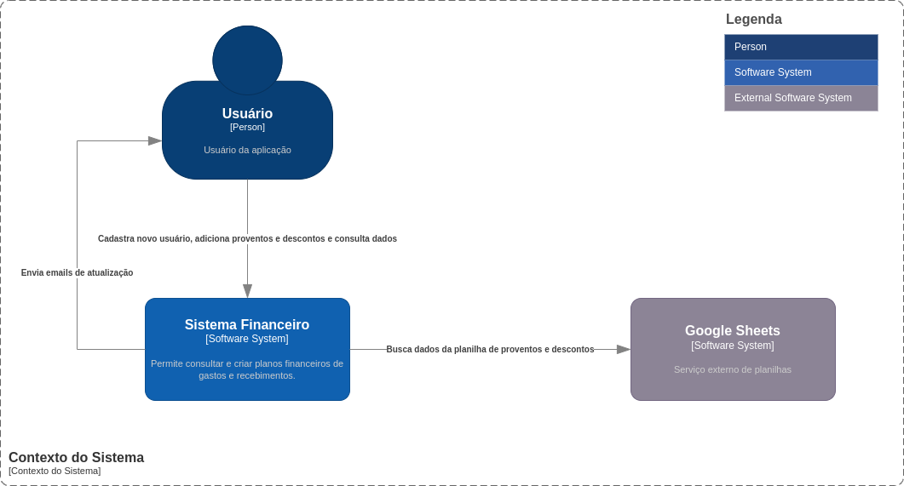
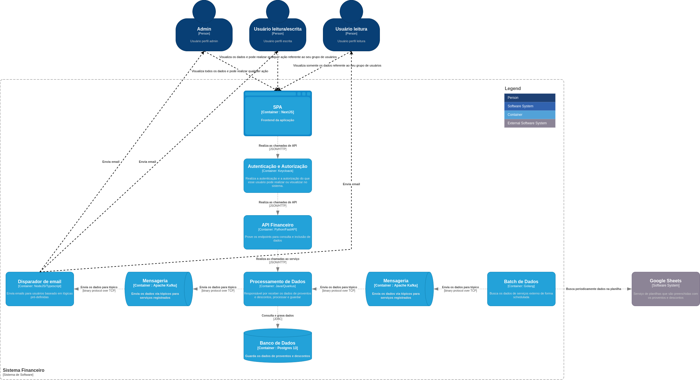

# Gestão Financeira

Serviço para gestão financeira utlizado para estudos de comunicação entre serviços.

## Desenho de arquitetura

docker exec --interactive --tty broker \
kafka-topics --bootstrap-server broker:9092 --list

docker exec --interactive --tty broker \
kafka-console-consumer --bootstrap-server broker:9092 \
                       --topic email-notification \
                       --from-beginning

cp -R base/* gf-theme/